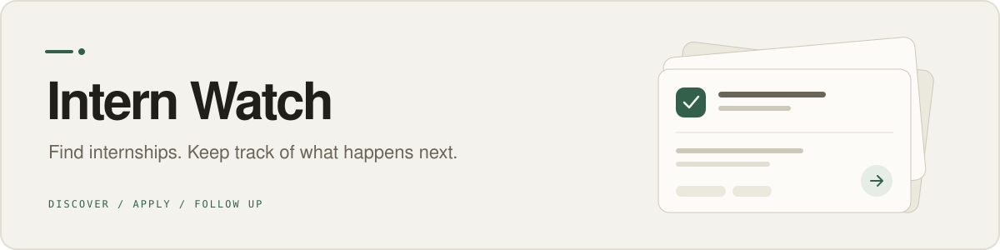
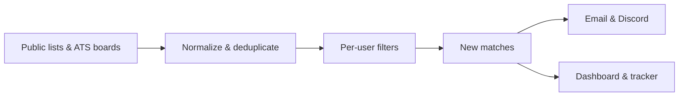

<p align="center">
  
</p>

<p align="center">
  <a href="#setup">Get started</a> ·
  <a href="#hosted-web-app-optional">Run the web app</a> ·
  <a href="#how-filtering-works">Configure your search</a> ·
  <a href="#documentation">Documentation</a>
</p>

Intern Watch watches public internship lists and employer job boards, filters postings to your preferences, and sends you new matches.
The optional web app keeps your shortlist, applications, resumes, and follow-ups together.

Start with a GitHub Actions watcher and email digests.
Add the hosted app when you want a place to manage the rest of the search.

## What you can do

| Capability | What it does |
| --- | --- |
| Discover internships | Poll multiple sources, deduplicate listings, and filter by role, season, company, location, and eligibility. |
| Get useful alerts | Receive scheduled email digests, immediate Discord notifications, and priority-company emails on the run that finds them. |
| Work through matches | Save, dismiss, or mark jobs applied in the hosted app or local UI. |
| Track applications | Keep statuses, notes, and application history after a posting leaves the match list. |
| Prepare resumes | Edit your profile, compose resume variants, export PDF or DOCX, and build a tailored resume for a job. |
| Follow up | Connect Gmail for application updates and review uncertain messages in Inbox. |

Browser-assisted applications are available separately through the [auto-apply CLI](docs/apply.md).
Autofill pauses before submission; submit mode requires an approved match.
The watcher does not submit applications.

## Choose your setup

| | GitHub watcher | Hosted app |
| --- | --- | --- |
| Best for | Alerts and a GitHub issue dashboard | Managing the full search in a browser |
| Runs on | GitHub Actions + Python | The watcher, plus Next.js + Convex + Clerk |
| Tracker storage | GitHub issue + committed JSON | Convex |
| Interface | Email, optional Discord, issue checkboxes, local Python UI | Matches, Tracker, Profile, Inbox, Settings |
| Start here | [Setup below](#setup) | [Local web development](docs/local-web-development.md) |

The default watcher needs no hosted database or web server.
Each user has a configuration file under `users/`; fetching is shared, while filtering and delivery run per user.

## Setup

Use Python 3.12, matching CI, and a GitHub repository with Actions enabled.
The shipped configuration uses Gmail for delivery and Gemini for ambiguous filtering decisions.

### 1. Create your copy

Create a repository from this template, or push a copy to your own repository, then clone it locally.
A private repository is fine.

In **Settings > Actions > General**, allow workflows to read and write repository contents.
Also enable **Allow GitHub Actions to create and approve pull requests** if you want the monthly board-refresh workflow to open update PRs.

### 2. Add the watcher secrets

Add these under **Settings > Secrets and variables > Actions**:

| Secret | Value |
| --- | --- |
| `GMAIL_ADDRESS` | Gmail account that sends the digest; also the default recipient |
| `GMAIL_APP_PASSWORD` | An app password for that account, with 2-Step Verification enabled |
| `GEMINI_API_KEY` | API key for the example configuration's Gemini classifier |

These names are already wired into [watch.yml](.github/workflows/watch.yml).
For a search without LLM calls, set `llm.enabled: false` and `unknown_term_policy: drop` in your user config.

### 3. Make the search yours

Edit [users/example.yaml](users/example.yaml), or rename it to `users/<you>.yaml` and change `name` to match.
Remove the example watcher if you create another file.

The defaults target US software and related roles, with broader summer matching and more selective spring and fall rules.
Review these before your first run:

- `role_filter` and `eliminate` for job titles and eligibility requirements.
- `terms` and `term_rules` for the rolling search window and seasonal rules.
- `priority` for employers you want to hear about first.
- `notify.email` for recipients, time zone, and digest hours.
- `llm.top_company_definition` for how the classifier judges an unfamiliar employer.

The example uses Atlanta-specific rules outside summer.
Adapt those rules and the [company lists](data/) to your search.

### 4. Validate locally

From the repository root:

```bash
python3.12 -m venv .venv
source .venv/bin/activate
python -m pip install -r requirements.txt
python -m src.config_check
```

The config check validates YAML and workflow secret wiring.
Its feature table may show credentials as disabled locally even when you have set them in GitHub.

To try the watcher locally, copy [.env.example](.env.example) to `.env`, fill in the required values, then run:

```bash
python -m src.main --dry-run
```

This fetches live sources without sending notifications or saving watcher state.
On an empty state file, it previews the initial seed; add `--backfill` to preview matching the current listings.
Configured LLM classification can still make API calls.

### 5. Start the watcher

Open **Actions > watch > Run workflow**.
The first run records existing listings without notifying you.
Later runs deliver newly discovered matches.

The schedule polls every two hours, with extra ticks to cover the example's winter email slots.
The default digest hours are **8am, noon, and 6pm America/New_York**, sent on the first run at or after each slot.
An empty outbox stays quiet, and failed email sends remain queued for retry.

With `dashboard: true`, the watcher maintains a matches issue.
Tick a checkbox when you apply; the next run preserves that choice.
Closing the issue pauses dashboard updates, and reopening it resumes them.

## How filtering works



The watcher checks roles and eligibility before spending API calls on ambiguous jobs.

1. **Role.** Titles must match an included keyword and no excluded keyword.
   Matching uses case-insensitive substrings; `data science` and `data scientist` need separate entries.
2. **Eligibility.** Optional eliminations cover country, unpaid work, graduate-only roles, active clearance, veteran-only programs, and posting age.
   ATS descriptions supply additional evidence when available.
3. **Term.** A rolling window selects upcoming seasons.
   You can pin exceptions with `include` and `exclude`, or use a fixed `terms_wanted` list.
4. **Company and location.** Seasonal presets or explicit rules decide which employers and locations qualify.
   Priority employers bypass these rules for wanted terms, after role and eligibility checks.
5. **Ambiguous facts.** Gemini or Anthropic can infer a term or judge company and metro fit.
   Verdicts are cached, and jobs deferred by the per-run cap are retried later.

For example, these blocks keep a rolling window and prioritize two employers.
Replace the matching blocks in your user file, keeping its notification and role-filter settings.

```yaml
terms:
  rolling: true
  lead_weeks: 3
  horizon_months: 14
  include: []
  exclude: []

term_rules:
  Spring: priority_only
  Summer: anything
  Fall: priority_only

priority:
  companies: [Microsoft, Stripe]
  from_tracker: false
  email_immediately: true
  subject_names: true
```

The hosted app's **Settings > Preferences** edits many of the same controls.
With the Convex store, saved preferences override the YAML on each watcher run.

> Filter changes apply to new or pending jobs.
> Previously rejected jobs are not automatically reconsidered, and cached company judgments do not reset when you edit the company definition.

## Sources

The checked-in [source registry](sources.yaml) defines the feeds and adapters used by the watcher.
Repository years below are the configured names, not a restriction on the terms their listings contain.

| Feed | Configured coverage |
| --- | --- |
| SimplifyJobs | `Summer2026-Internships` structured listings, including multiple terms |
| Jobright | Public 2026 Software Engineer, Engineer, Product Management, and Data Analysis README mirrors |
| vanshb03 | `Summer2027-Internships`, including the offseason README |
| speedyapply | `2026-SWE-College-Jobs` internship tables |
| Employer boards | Public Greenhouse, Lever, and Ashby APIs listed in [ats_boards.yaml](data/ats_boards.yaml) |

Adding a feed supported by an existing adapter is a configuration change.
New formats need an adapter under [`src/adapters/`](src/adapters/).
The monthly [refresh-boards workflow](.github/workflows/refresh-boards.yml) proposes updates to the employer-board registry.

Coverage depends on those sources.
Public mirrors can omit postings, and a short-lived listing can disappear between polls.
Repeated source failures trigger health warnings in email rather than clearing existing state.

## Hosted web app (optional)

The app in [`web/`](web/) uses Next.js 16, React 19, TypeScript, Tailwind CSS, Clerk sign-in, and Convex.
It includes keyboard navigation, a command palette, and light and dark themes.

- **Matches and Tracker** manage saved jobs, applications, statuses, notes, and job-specific resume builds.
  You can also add a job by URL.
- **Profile** imports resumes, edits your experience bank, composes variants, and exports PDF or DOCX.
- **Inbox** queues uncertain Gmail matches for review.
- **Settings** manages search preferences, connections, and resume model choices.

Follow [local web development](docs/local-web-development.md) for the complete setup, including the development Convex backend, Clerk mapping, and optional Gmail callback.
Hosted resume builds run in Convex; the standalone Python resume tools and Actions workflows remain available separately.

The optional [script API](docs/api.md) lets authenticated scripts manage matches, applications, resumes, and settings through `/api/v1`.
Access uses per-user API keys and stays disabled until configured.

For Vercel, set the project root to `web` and the build command to `bash ../scripts/vercel-build.sh`.
The [build script](scripts/vercel-build.sh) documents the preview secrets and optional seed snapshot; configured previews get a separate Convex backend per branch.
Production Convex deployment runs through [deploy-convex.yml](.github/workflows/deploy-convex.yml) when `CONVEX_DEPLOY_KEY` is set.

### Database backend

`STORE=github` is the default.
Set `STORE=convex` to share tracker state between the watcher, local UI, and hosted app.
The watcher still maintains its discovery cache in `state/seen.json`.

| Setting | Where it goes |
| --- | --- |
| `TRACKER_SECRET` | Convex deployment environment |
| `STORE=convex` | GitHub Actions variable and local Python `.env` |
| `CONVEX_URL` | GitHub Actions secret, local Python `.env`, and web server environment |
| `CONVEX_SECRET` | Same locations as `CONVEX_URL`; must match `TRACKER_SECRET` |

The web app has additional settings in [web/.env.example](web/.env.example).
Python, Next.js, and Convex each have their own environment; values do not transfer between them.
With Convex enabled, the GitHub issue becomes a read-only digest.

<details>
<summary>Migrate an existing GitHub tracker</summary>

Deploy the Convex backend and make `CONVEX_URL` and `CONVEX_SECRET` available as exported environment variables first.
Let the watcher fold your latest issue checkboxes into state, then fetch the latest data-repo `origin/main`.
Before switching `STORE`, preview and run the migration from the code checkout:

```bash
python scripts/migrate_tracker_to_convex.py --dry-run
python scripts/migrate_tracker_to_convex.py
```

The migration copies ticks, application history, and the match snapshot using repeatable upserts.
For separate code and data repos, also pass `--root /path/to/private-data-repo` to both migration commands.
This script reads that explicit path rather than `INTERN_WATCH_DATA_DIR`.

</details>

## Keep personal data separate

A single private repository is enough to start.
For an instance that follows updates to this codebase, use a private data repository for `users/`, `state/`, `resumes/`, secrets, and the dashboard issue.

```text
intern-watch/                 private data repo/
  src/                         users/
  convex/                      state/
  web/                         resumes/
  sources.yaml                 .github/workflows/
  data/                        .env
```

Run local tools from the code checkout with `INTERN_WATCH_DATA_DIR` pointing to the data repo.
Without that variable, the tools use this repository for both code and data.

<details>
<summary>Connect a private data repo with a reusable workflow</summary>

Create `users/`, an empty `state/`, and a copy of [.gitattributes](.gitattributes) in the data repo.
Add the watcher secrets there, then create `.github/workflows/watch.yml` with the following content.
Replace `<owner>/intern-watch` with the code repository you use.

```yaml
name: watch
on:
  schedule:
    - cron: "0 */2 * * *"
    - cron: "0 13,17,23 * * *"
  workflow_dispatch:
    inputs:
      send_now:
        type: boolean
        default: false
permissions:
  contents: write
  issues: write
jobs:
  watch:
    uses: <owner>/intern-watch/.github/workflows/watch.yml@main
    with:
      send_now: ${{ inputs.send_now || false }}
    secrets: inherit
```

The reusable workflow checks out the data repo and the code repo, sets `INTERN_WATCH_DATA_DIR`, and commits state back to the data repo.
A private code repo also needs `CODE_REPO_TOKEN` with read access.
The `dashboard-write`, `resume`, `resume-batch`, and `resume-ondemand` workflows also support reusable calls.

For staging, the reusable workflows accept `code_ref`, `data_ref`, and `environment` inputs to select a code revision, data branch, and GitHub environment.

</details>

Config files reference secret **names**; real credentials belong in Actions secrets, deployment environments, or gitignored local files.
When adding a user or notification channel, wire any new secret names into the workflow's `env` block and run `python -m src.config_check`.

## Development and troubleshooting

The Python pipeline lives in `src/`, backend functions in `convex/`, the hosted app in `web/`, and shared TypeScript logic and fixtures in `shared/`.

Install Python development dependencies and run the same checks as Python CI:

```bash
python -m pip install -r requirements-dev.txt
python -m ruff check .
python -m mypy
python -m src.config_check
python -m pytest tests -q
```

For TypeScript work, install both dependency sets with `npm ci` and `npm --prefix web ci`.
After generating Convex bindings through the [development setup](docs/local-web-development.md), run:

```bash
npm test
npm --prefix web run lint
npm --prefix web run typecheck
npm --prefix web run build
```

<details>
<summary>Watcher commands and state behavior</summary>

| Command | Use |
| --- | --- |
| `python -m src.main --dry-run` | Fetch and preview without notifications or watcher-state writes |
| `python -m src.main --dry-run --backfill` | Preview the current listings on an empty state file |
| `python -m src.main --explain 'jr:<24-hex>' --user example` | Trace one job's filtering decision without notifying or saving state |
| `python -m src.main --send-now` | Run the watcher and flush the email outbox immediately |
| `python -m src.main --seed` | Mark current listings seen without notifying, such as after adding a source |
| `python -m src.webui` | Open the local Python application manager |

The discovery cache expires entries not seen for 120 days.
The application ledger is permanent and is never pruned with the cache.
Actions owns committed state files, so inspect the current data-repo `origin/main` when debugging instead of trusting a stale local copy.

If a job never appeared in a configured source, filter changes cannot recover it.
If it was already rejected, changing a rule does not automatically evaluate it again.
Company judgments are cached per user; changing the prose definition does not invalidate an existing verdict.

</details>

## Documentation

| Guide | Covers |
| --- | --- |
| [Watcher quickstart](docs/quickstart.md) | Step-by-step walkthrough for a fresh instance |
| [Local web development](docs/local-web-development.md) | Next.js, Clerk, Convex, and development environment setup |
| [Script API](docs/api.md) | Per-user API keys, endpoints, and OpenAPI discovery |
| [Resume builder](docs/resume.md) | Python resume bank, selection, tailoring, and DOCX output |
| [Automatic resume builds](docs/resume-auto.md) | Watcher and Actions delivery modes, with [known limitations](docs/resume-auto-limitations.md) |
| [Mail sync](docs/mail-sync.md) | Gmail connection, status classification, and Inbox review |
| [Auto-apply](docs/apply.md) | Answer book, browser filling, approval gates, and supported flows |
| [Browserbase](docs/browserbase.md) | Cloud browser setup for application tools |

## License

[MIT](LICENSE)
